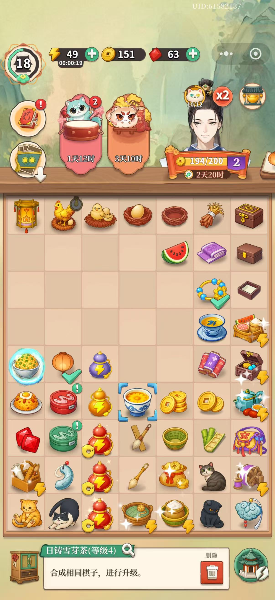

# 合合游戏 (HéHé Game)

一款以古风茶楼为主题的合成消除手机网页游戏，灵感来源于《梦幻消除战》。

## 游戏截图

| 主界面 | 活动界面 |
|:---:|:---:|
|  |  |

## 游戏特色

- **7×9 合成棋盘**：63 格棋盘，支持拖拽合成、锁定棋子解锁等多种操作
- **6 大棋子链**：禽类、茶叶、糕点、灯笼、首饰、纺织，每链最高 5–15 级
- **锁定棋子机制**：部分高级棋子初始为锁定状态，需拖拽同类低级棋子解锁
- **生成器棋子**：老母鸡🐔（自动）、茶壶🫖、竹华食篓🧺、手作盒📦、妆奁💄、纺车🪡（点击消耗体力⚡）可生成低级棋子
- **订单系统**：随机订单需提交指定棋子，完成后获得铜板奖励，超时自动失效
- **体力 / 经济系统**：体力每 2 分钟自动恢复 1 点；升级时体力全满；铜板、宝石独立计量

## 技术栈

| 技术 | 版本 | 用途 |
|---|---|---|
| React | 18 | UI 框架 |
| TypeScript | 5 | 类型安全 |
| Vite | 5 | 构建工具 |
| Zustand + Immer | 4 / 10 | 状态管理 |
| Framer Motion | 11 | 动画效果 |

## 棋子链一览

### 禽类链（最高 7 级）
`老母鸡🐔(自动生成)` → `鸡蛋🥚(1)` → `荷包蛋🍳(2)` → `蛋炒饭(3)` → `蛋炒盖饭(4)` → `鸡腿盖饭(5)` → `飘香烤鸡(6)` → `荷叶蒸鸡🪺(7)`

### 茶叶链（最高 6 级）
`茶壶🫖(点击生成)` → `热茶🍵(1)` → `日驻雪芽茶🌿(2)` → `方山露芽茶🍃(3)` → `碧螺春🌱(4)` → `特级龙井☕(5)` → `普洱茶🧉(6)`

### 糕点链（最高 15 级）
`竹华食篓🧺(点击生成)` → `柿柿如意盒🎑(1)` → `桂花糖糕🍡(2)` → `玫瑰鲜花饼🌸(3)` → `蛋黄酥🥐(4)` → `海棠糕🎂(5)` → `宫廷糕点🍰(6–14)` → `玉兔摘柿盒🍮(15)`

### 灯笼链（最高 12 级）
`手作盒📦(点击生成)` → `纸糊灯笼🕯️(1)` → `圆灯笼🏮(2)` → `彩灯笼🪔(3)` → `宫廷灯💡(4–11)` → `九龙玉灯🔆(12)`

### 首饰链（最高 5 级）
`妆奁💄(点击生成)` → `金戒指💍(1)` → `雕花耳坠📿(2)` → `银镯子⭕(3)` → `翡翠镯💚(4)` → `龙凤佩💎(5)`

### 纺织链（最高 5 级）
`纺车🪡(点击生成)` → `白色布匹🧵(1)` → `描金绣花手袋👜(2)` → `香囊🎒(3)` → `货郎包💼(4)` → `绸缎🎀(5)`

## 游戏操作

| 操作 | 效果 |
|---|---|
| 拖动棋子到同类同级格 | 合成升级 |
| 拖动棋子到空格 | 移动 |
| 拖动低级棋子到🔒锁定格 | 消耗该棋子，减少解锁次数 |
| 点击⚡生成器棋子 | 消耗 1 体力，生成低级棋子 |
| 点击棋子 | 查看详情及删除 |

## 本地开发

```bash
# 安装依赖
npm install

# 启动开发服务器
npm run dev

# 构建生产版本
npm run build

# 预览生产版本
npm run preview
```

## 部署到 GitHub Pages

项目已通过 GitHub Actions 自动部署至 GitHub Pages。推送到 `main` 分支后，工作流将自动执行 `npm run build` 并将 `dist/` 目录发布到 Pages。

---

> 设计参考文档：[desgin-doc.md](desgin-doc.md)
